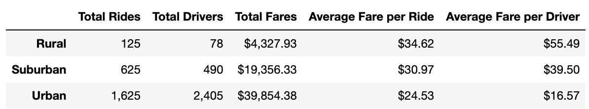
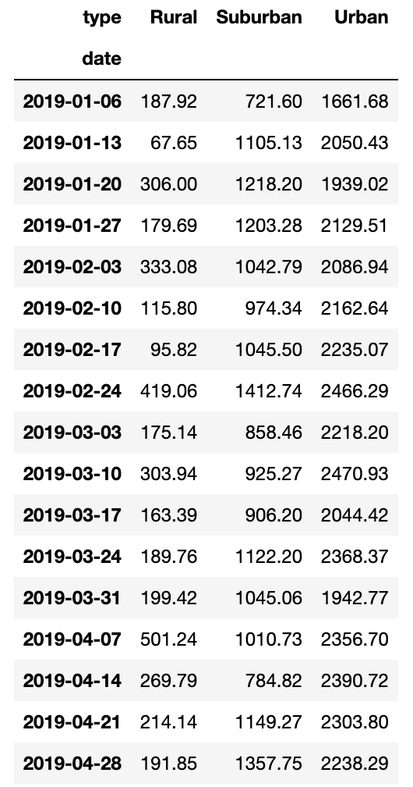
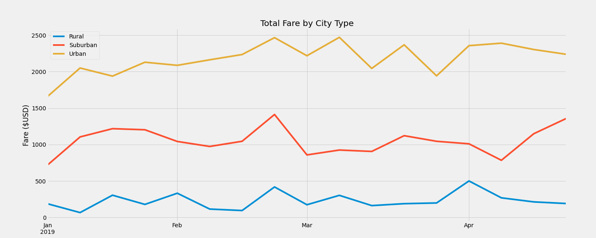

# PyBer_Analysis
### Overview
The purpose of this project is to analyze the usage of PyBer, a ride-sharing app, across the country, specifically focusing on the differences in utilization between urban, suburban and rural communities.

### Resources
Data Sources: [Ride Data CSV](Resources/ride_data.csv) & [City Data CSV](Resources/city_data.csv)
Software: Python 3.9.12, Jupyter Notebooks, Matplotlib

### Results
After merging the two datasets into a single dataframe, I was able to calculate the total number of drivers, number of rides and total fares broken down by the type of city. I then calculated the average fare per ride and the average fare per driver as well. This information can be seen here:

As you can see from this table, rural drivers are making more per ride than their urban counterparts and rural riders are paying more than their urban counterparts, but PyBer has made more money in the urban market overall. The suburban market is interesting because PyBer makes a lot of money from the suburbs than rural areas, but suburban riders are still paying almost the same amount as rural riders.

Next, I created a pivot table of the data examining the sum of the total fares for rural, suburban and urban areas for each date. Once the data was visible in this way, I resampled it to look at the total fares per week for each city type and created the following table and chart:

This line graph shows a relatively stable and unchanging market for PyBer in each city type: the total fares in rural markets are very low in comparison to urban and suburban markets. The suburban market does show some promise towards the end of April, however, and I will talk more about that promise in the summary notes for the company.

### Summary

Based on the data analysis I was asked to do for PyBer, I can safely make the following recommendations for the CEO:

1. Raise the fare for the urban market. 68% of PyBer's riders come from urban cities, but only 62% of its total fares come from urban cities. Not to mention that over 80% of PyBer's drivers are driving in urban cities and are making less per ride than their suburban and rural counterparts.
2. Recruit suburban drivers. Both the rural and suburban markets have more demand than they are able to fulfill with the drivers that they currently have, but after examining the line graph at the end of my "results" section, it is evident that the suburban market has a higher demand than the rural market. There is a substantial uptick in the total fares per week for the suburban cities at the very end of April, indicating that the suburban market might be seeing some increase in demand, which will certainly require more drivers.
3. Continue advertising in the rural areas among both potential riders and drivers. The usage of PyBer in rural markets is relatively low, in comparison to the suburban and urban cities. I would suggest the leadership of PyBer examine what is causing that (lack of demand, lack of knowledge, inefficient service, high fares, etc). While the suburban and urban areas both seem to be generating a reasonable amount of revenue, rural areas are still far behind.
